# 🏆 GitHub Enterprise Compliance Setup Guide
## MEWAYZ Platform - Automated Compliance & BugBot Integration

---

## 🎯 Overview

This document provides a complete guide for setting up GitHub with enterprise-grade compliance monitoring, automated issue resolution, and continuous security scanning. The system ensures **100% compliance** with enterprise context rules while providing seamless background automation.

---

## 🚀 Quick Setup

### **Option 1: Automated Setup (Recommended)**
```bash
# Make script executable (Linux/macOS)
chmod +x scripts/setup-github-compliance.sh

# Run setup script
./scripts/setup-github-compliance.sh
```

### **Option 2: Manual Setup**
Follow the steps in this document to manually configure each component.

---

## 📋 Prerequisites

Before starting, ensure you have:

- [x] **Git** installed and configured
- [x] **GitHub CLI** (`gh`) installed
- [x] **GitHub account** with repository access
- [x] **Node.js** and npm for dependency management
- [x] **Administrative access** to enable repository features

### Install GitHub CLI
```bash
# Using npm
npm install -g @github/cli

# Using homebrew (macOS)
brew install gh

# Using chocolatey (Windows)
choco install gh
```

---

## 🏗️ Architecture Overview

The compliance system consists of several integrated components:

```mermaid
graph TD
    A[Developer Commits] --> B[GitHub Actions Trigger]
    B --> C[Compliance Check Workflow]
    B --> D[BugBot Analysis Workflow]
    B --> E[Security Scan Workflow]
    
    C --> F{Compliance Score}
    F -->|100%| G[✅ Deploy Allowed]
    F -->|<100%| H[❌ Deploy Blocked]
    
    D --> I[Issue Detection]
    I --> J[Automated Fixes]
    J --> K[Pull Request Created]
    
    E --> L[Security Analysis]
    L --> M[Vulnerability Report]
    L --> N[Auto-remediation]
```



---

## 🔧 Components Installed

### **1. GitHub Actions Workflows**

| Workflow | File | Purpose | Trigger |
|----------|------|---------|---------|
| **Enterprise Compliance** | `.github/workflows/enterprise-compliance.yml` | Validates 100% rule compliance | Push, PR, Schedule |
| **BugBot Auto-Fix** | `.github/workflows/bugbot-auto-fix.yml` | Automated issue resolution | Schedule, Manual |
| **Security Scanning** | Various security tools | Vulnerability detection | Continuous |

### **2. Compliance Configuration**

| File | Purpose |
|------|---------|
| `.github/compliance-config.yml` | Complete rule definitions and enforcement settings |
| `.github/ISSUE_TEMPLATE/compliance-violation.yml` | Structured compliance issue reporting |

### **3. Automated Quality Gates**

- ✅ **Mock Data Detection** - Zero tolerance for mock/hard-coded data
- ✅ **Authentication Validation** - Single enterprise auth system enforcement
- ✅ **Database Integration** - Real database operations required
- ✅ **Style Compliance** - 100% style-reference adherence
- ✅ **Security Standards** - Enterprise security compliance
- ✅ **Performance Monitoring** - Automated performance optimization

---

## 🤖 BugBot Capabilities

### **Automated Issue Detection**
- **Mock Data Usage** - Identifies and flags mock data violations
- **Security Vulnerabilities** - Scans for security issues and insecure patterns
- **Style Violations** - Detects custom styling that violates style-reference
- **Performance Issues** - Identifies inefficient queries and missing indexes
- **Compliance Gaps** - Comprehensive enterprise rule validation

### **Automated Fixes**
- **Mock Data Removal** - Replaces with database operation placeholders
- **Security Patches** - Fixes npm vulnerabilities and insecure patterns
- **Code Style** - ESLint auto-fixes and formatting corrections
- **Performance Optimization** - Adds pagination and query improvements
- **Compliance Comments** - Adds guidance for manual fixes

### **Intelligent Workflow**
1. **Detection** - Scans code every 6 hours and on commits
2. **Analysis** - Categorizes issues by severity and type
3. **Auto-Fix** - Applies safe automated fixes
4. **Pull Request** - Creates PR with detailed fix report
5. **Verification** - Re-runs checks to confirm fixes
6. **Notification** - Reports status and remaining manual tasks

---

## 📊 Compliance Monitoring

### **Real-time Dashboard**
Access compliance status through:
- **GitHub Actions Tab** - Live workflow status
- **Issues Tab** - Compliance violation reports
- **Pull Requests** - BugBot automated fixes
- **Security Tab** - Vulnerability scanning results

### **Compliance Scoring**
```
Score Calculation:
- Mock Data: 0 violations = 100 points
- Authentication: Single system = 100 points  
- Database: Real operations = 100 points
- Style: Reference compliance = 100 points
- Security: No vulnerabilities = 100 points
- Performance: Optimized = 100 points

Total: 600 points = 100% compliance
```

### **Quality Gates**
| Gate | Threshold | Action |
|------|-----------|--------|
| **Critical Violations** | 0 | Block deployment |
| **Security Issues** | 0 | Block deployment |
| **Mock Data** | 0 | Block deployment |
| **Compliance Score** | 100% | Allow deployment |

---

## 🔒 Security Features

### **Automated Security Scanning**
- **CodeQL Analysis** - Static application security testing
- **Dependency Review** - Vulnerability scanning for dependencies
- **Secret Scanning** - Prevents credential leaks
- **SAST Integration** - Comprehensive security analysis

### **Security Standards Enforcement**
- **JWT Security** - Enterprise-grade token management
- **Password Hashing** - bcrypt with minimum 12 rounds
- **Rate Limiting** - API protection against abuse
- **Security Headers** - XSS, CSRF, and other protections
- **Audit Logging** - Complete security event tracking

---

## 📝 Usage Instructions

### **Daily Development Workflow**

1. **Develop Normally** - Write code following enterprise patterns
2. **Commit Changes** - Push commits trigger automatic compliance checks
3. **Review Results** - Check GitHub Actions for compliance status
4. **Address Issues** - BugBot will auto-fix many issues automatically
5. **Manual Fixes** - Handle remaining issues using guidance provided

### **Compliance Violation Response**

When compliance violations are detected:

1. **Automatic Detection** - System identifies and categorizes violations
2. **BugBot Analysis** - Attempts automated fixes within 6 hours
3. **Pull Request** - Auto-fix PR created with detailed report
4. **Manual Review** - Developer reviews and merges BugBot fixes
5. **Issue Creation** - Manual issues created for complex violations

### **Using Issue Templates**

For reporting compliance violations:
1. Go to **Issues** → **New Issue**
2. Select **🚨 Compliance Violation Report**
3. Fill out the structured template
4. Submit for automated triage and assignment

---

## 🔧 Configuration Customization

### **Modifying Compliance Rules**

Edit `.github/compliance-config.yml` to customize:

```yaml
rules:
  mock_data:
    enabled: true
    severity: critical
    auto_fix: true
    
  security:
    npm_audit:
      max_severity: "moderate"
    forbidden_patterns:
      - "console\\.log.*password"
```

### **BugBot Behavior**

Customize automated fixes:

```yaml
auto_fix:
  enabled: true
  strategies:
    comment_violation:
      action: "replace_with_comment"
```

### **Workflow Schedules**

Modify workflow timing in `.github/workflows/`:

```yaml
schedule:
  - cron: '0 */6 * * *'  # Every 6 hours
```

---

## 🎯 Enterprise Features

### **Plan-Specific Compliance**
- **Free Plan** - Standard compliance monitoring
- **Pro Plan** - Enhanced notifications and reporting
- **Enterprise Plan** - Advanced audit logging and SLA guarantees

### **White-Label Support**
- **Custom Branding** - Branded compliance reports
- **Custom Domains** - Company-specific issue tracking
- **Dedicated Support** - Priority compliance assistance

### **Audit and Reporting**
- **Compliance History** - 90-day retention of compliance data
- **Trend Analysis** - Compliance score tracking over time
- **Export Formats** - Markdown, JSON, CSV reports
- **Integration Ready** - API access for enterprise monitoring

---

## 🚨 Troubleshooting

### **Common Issues and Solutions**

#### Workflow Failures
```bash
# Check workflow status
gh run list

# View specific run details
gh run view [run-id]

# Re-run failed workflows
gh run rerun [run-id]
```

#### BugBot Not Working
1. **Check Permissions** - Ensure BugBot has write access
2. **Review Logs** - Check GitHub Actions logs for errors
3. **Manual Trigger** - Run BugBot workflow manually
4. **Configuration** - Verify compliance-config.yml syntax

#### False Positives
1. **Update Patterns** - Modify detection patterns in config
2. **Exclude Directories** - Add exclusions for specific paths
3. **Custom Rules** - Create organization-specific rules

### **Getting Help**

- **GitHub Issues** - Use compliance violation template
- **Documentation** - Review configuration files
- **Logs** - Check GitHub Actions workflow logs
- **Manual Override** - Contact admin for emergency bypasses

---

## 📈 Success Metrics

### **Compliance KPIs**
- **Compliance Score**: Target 100%
- **Violation Reduction**: 95% auto-resolution rate
- **Fix Success Rate**: 85% automated fixes
- **Resolution Time**: <1 hour average

### **Quality Indicators**
- ✅ **Zero Mock Data** - No mock/hard-coded data
- ✅ **Single Auth System** - Unified enterprise authentication
- ✅ **Real Database Ops** - All CRUD operations persist
- ✅ **Enterprise Security** - Full security compliance
- ✅ **Production Ready** - Deployment-ready code quality

---

## 🔄 Maintenance

### **Regular Tasks**
- **Monthly** - Review compliance configuration
- **Quarterly** - Update security scanning rules
- **Annually** - Major compliance standard updates

### **Updates**
- **Automatic** - BugBot and security scans auto-update
- **Manual** - Configuration changes require review
- **Versioned** - All changes tracked in git history

---

## 🎉 Next Steps

1. **✅ Setup Complete** - All systems operational
2. **🔧 Customize Config** - Adjust rules for your needs
3. **👥 Team Training** - Train team on compliance workflows
4. **📊 Monitor Results** - Track compliance improvements
5. **🚀 Scale Usage** - Apply to additional repositories

---

## 🏆 Conclusion

You now have a **world-class enterprise compliance system** that:

- **Automatically enforces** 100% compliance with enterprise rules
- **Proactively fixes** issues before they become problems
- **Continuously monitors** code quality and security
- **Provides real-time feedback** on compliance status
- **Scales seamlessly** with your development workflow

**Your development team can now focus on building features while the system ensures enterprise compliance automatically!**

---

*Generated by MEWAYZ Enterprise Compliance System*  
*For support, create an issue using the compliance violation template* 